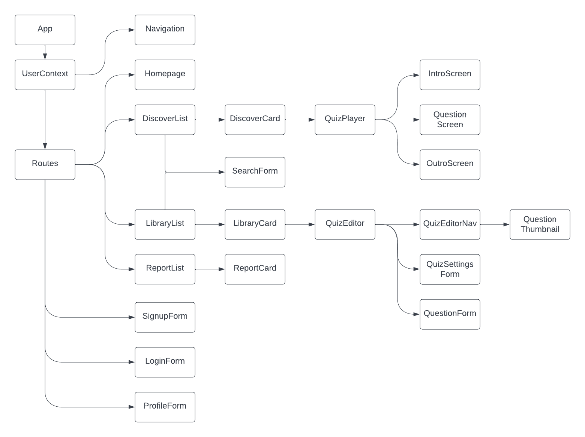

# Quizzly

This is the git repo for the *front end* of the Quizzly app. The app's back end can be found at this repo [quizzly-backend](https://github.com/jermer/quizzly-backend).

Quizzly was created by [Jason Ermer](https://www.linkedin.com/in/jasonermer/). The project was inspired by and emulates [Kahoot!](https://kahoot.com/) and was completed as part of the [Springboard](https://www.springboard.com) Software Engineering Career Track.

The logo is [artificial intelligence](https://game-icons.net/1x1/lord-berandas/artificial-intelligence.html) by Lord Berandas, available from [game-icons.net](https://game-icons.net/) and used under a [CC-BY 3.0](https://creativecommons.org/licenses/by/3.0/) license.

### Overview

*Kahoot!* is an online platform for creating and playing learning games ([website](https://kahoot.com/schools/how-it-works/), [wiki](https://en.wikipedia.org/wiki/Kahoot!)). Creators, typically teachers, register with Kahoot! and build multiple-choice quizzes through a web interface. Players, typically students, access Kahoot! quizzes via a web browser.

This project, *Quizzly*, implements a subset of Kahoot! functionality.

The quiz-maker interface allows users to create, edit, and publish multiple-choice quizzes. The quiz-taker interface allows users to browse published quizzes, take quizzes, and keep a log of their quiz scores.

### Tech Stack

Quizzly has a React front end (component hierarchy shown below), and a Node/Express [backend](https://github.com/jermer/quizzly-backend) with a Postgres database.

### Data Security

Very little user data will be stored apart from username, email, and password. However, given that my platform caters to teachers and students, I must look into data security considerations associated with students under 13 years of age, in compliance with the Children’s Online Privacy Protection Act ([COPPA](https://www.ftc.gov/business-guidance/resources/childrens-online-privacy-protection-rule-six-step-compliance-plan-your-business)).

### Future Work

Areas of future front end development include:
- Auto-save in quiz editor
- Enable question navigation panel to scroll separately from editor panel
- Second prompt before quiz deletion
- Allow thumbnail images for quizzes

### Installation

In the project directory:
- Execute `npm install` to install packages and dependencies.
- Execute `psql < quizzly.sql` to create, set-up, and seed the production database `quizzly`, and the testing database `quizzly-test`.
- To launch the front end, execute `npm start`.
- To run tests, execute `npm test`.

